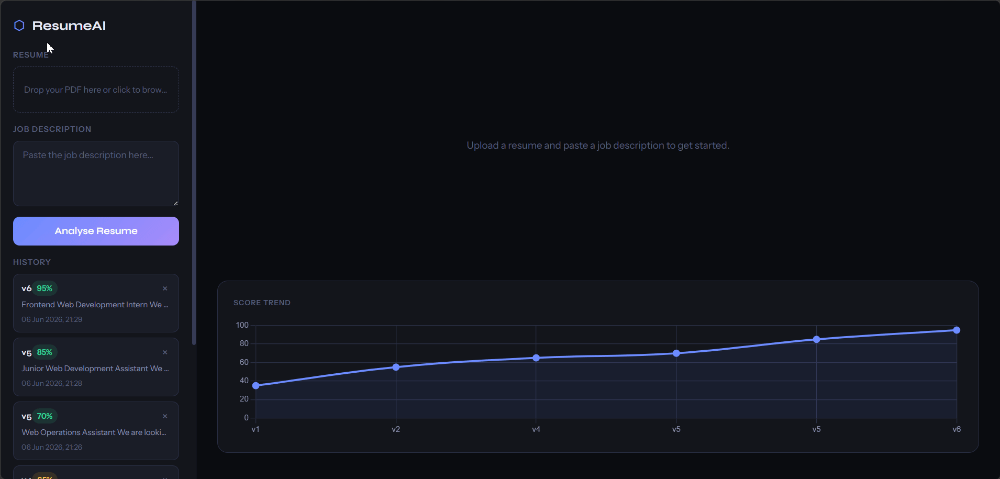

# AI Resume Analyser

An AI-powered resume analysis tool that compares your resume against a job
description and gives you a structured match score, keyword gap analysis,
section-by-section ratings, and AI-generated improvement suggestions.

Built as a full-stack portfolio project using Python Flask and the Google
Gemini API.

---

## Demo



---

## Features

- **PDF Upload & Extraction** — drag and drop any text-based PDF resume
- **AI-Powered Analysis** — structured JSON response from Gemini 2.5 Flash Lite
- **Match Score Gauge** — animated circular SVG gauge showing your match percentage
- **Keyword Gap Analysis** — green tags for present skills, red tags for missing ones
- **Section Breakdown** — Work Experience, Skills, Projects, Education, and Summary
  each rated individually with animated progress bars
- **Version History** — every analysis saved to SQLite with timestamp and score
- **Score Trend Graph** — Chart.js line chart showing your improvement over time
- **Bullet Point Rewriter** — click any weak bullet point to get an AI-rewritten
  version inline, without a page reload
- **Graceful Error Handling** — friendly messages for bad PDFs, empty inputs,
  and API rate limits
- **Responsive Design** — works on mobile and desktop
- **Dark UI** — clean, product-grade interface inspired by Linear and Vercel
- **Delete History** — remove individual analysis entries from version history

---

## Tech Stack

| Layer | Technology |
|---|---|
| Backend | Python 3, Flask |
| PDF Extraction | PyMuPDF (fitz) |
| AI | Google Gemini 2.5 Flash Lite (google-genai) |
| Database | SQLite3 (built-in) |
| Frontend | Vanilla HTML, CSS, JavaScript |
| Charts | Chart.js (CDN) |
| Fonts | Google Fonts — Syne + Instrument Sans |
| Environment | python-dotenv |

---

## Local Setup

### Prerequisites
- Python 3.10 or higher
- A free [Google Gemini API key](https://aistudio.google.com/app/apikey)

### Steps

**1. Clone the repository**
```bash
git clone https://github.com/rohanmeshramit/AI-Resume-Analyser.git
cd AI-Resume-Analyser
```

**2. Create and activate a virtual environment**
```bash
# Windows
python -m venv venv
venv\Scripts\activate

# macOS / Linux
python3 -m venv venv
source venv/bin/activate
```

**3. Install dependencies**
```bash
pip install -r requirements.txt
```

**4. Create your `.env` file**

Create a file named `.env` in the project root with this content:
```
GEMINI_API_KEY=your_api_key_here
```

**5. Run the app**
```bash
python app.py
```

Open your browser and go to `http://127.0.0.1:5000`

---

## Project Structure

```
AI-Resume-Analyser/
├── app.py              # Flask routes and API endpoints
├── extractor.py        # PDF text extraction with PyMuPDF
├── analyser.py         # Gemini API integration and prompt engineering
├── database.py         # SQLite setup and query functions
├── static/
│   ├── style.css       # All styles and CSS variables
│   └── script.js       # Frontend logic and Chart.js
├── templates/
│   └── index.html      # Single-page app layout
├── uploads/            # Temporary PDF storage (gitignored)
├── .env                # API key — never committed
├── .gitignore
├── requirements.txt
└── README.md
```

---

## Known Limitations

- **Free tier limit** — Gemini free tier allows approximately 20 analyses per day
- **Text PDFs only** — scanned image-based PDFs are not supported (no OCR)
- **Single user** — no authentication; designed for personal use
- **Version numbering** — version numbers do not renumber after a history entry
  is deleted

---

## Author

Built by [Rohan Meshram](https://github.com/rohanmeshramit) — BSc IT student, Mumbai.